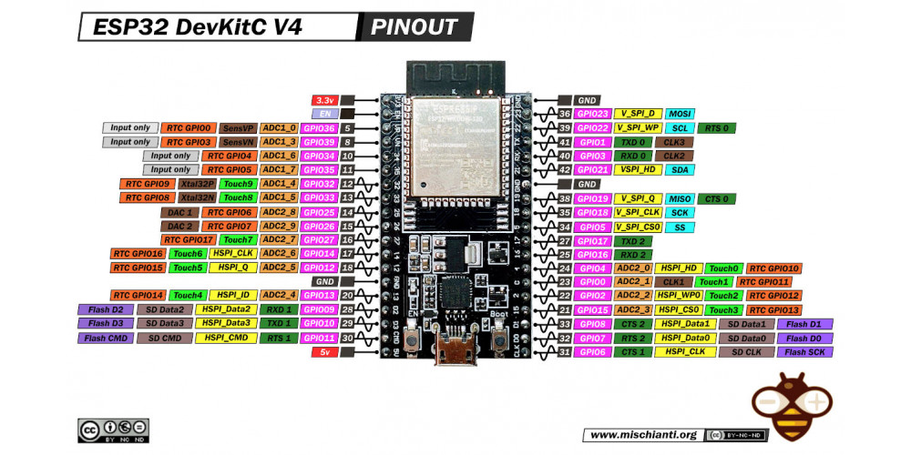
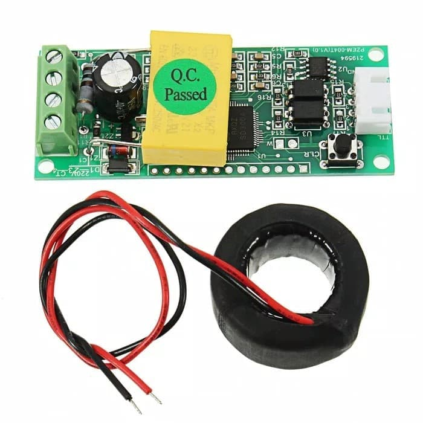
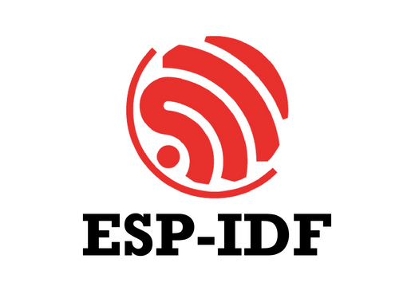

# ⚡ ESP32 Power Monitoring Firmware (Wi-Fi + Telegram)

Firmware ini dirancang untuk mikrokontroler **ESP32** yang berfungsi sebagai sistem pemantau daya listrik berbasis **Wi-Fi** dan terintegrasi dengan **Telegram Bot** sebagai media notifikasi otomatis.

---

## 📡 Fitur Utama

- 📊 **Pemantauan Daya Real-Time**  
  Membaca tegangan, arus, dan daya dari sensor seperti **PZEM-004T**.

- 🌐 **Koneksi Wi-Fi Otomatis**  
  Untuk mengirimkan data pemantauan ke Telegram atau dashboard.

- 🔔 **Notifikasi Telegram Otomatis**  
  Dikirim saat daya melewati batas atau terjadi gangguan.

- 🔌 **Kontrol Relay Otomatis/Manual**  
  Menyalakan atau mematikan beban listrik dari Telegram atau logika otomatis.

- 🔁 **Reboot dan Tes Fungsi Langsung**  
  Dukungan untuk restart perangkat dan uji kirim Telegram dari antarmuka serial.

---

## 🖼️ Perangkat Pendukung

### ESP32 DevKit

### Sensor PZEM-004T

### Platform Pengembangan

---

## 📋 Konfigurasi yang Didukung

- SSID dan password Wi-Fi
- Token dan ID chat Telegram
- Batas maksimal daya (untuk alarm)
- ID sensor
- Mode kontrol relay (otomatis/manual)

---

## 🚀 Cara Penggunaan

1. **Flash firmware** ke board ESP32 menggunakan PlatformIO atau ESP-IDF.
2. Atur konfigurasi awal via **Serial** atau file konfigurasi `config.json`.
3. Sambungkan sensor daya dan relay.
4. Hubungkan ke Telegram untuk menerima notifikasi otomatis.

---

## 📁 Struktur Proyek

    <h2>METERAN_ONLINE</h2>
    <ul>
        <li class="folder">.devcontainer/</li>
        <li class="folder">.vscode/</li>
        <li class="folder">build/</li>
        <li class="folder">main/
            <ul>
                <li class="file">CMakeLists.txt</li>
                <li class="file">i2c-lcd.c</li>
                <li class="file">i2c-lcd.h</li>
                <li class="file">meteran_online.c</li>
                <li class="file">pzem004tv3.c</li>
                <li class="file">pzem004tv3.h</li>
                <li class="file">telegram_root_cert.h</li>
            </ul>
        </li>
        <li class="folder">pictures/</li>
        <li class="file">CMakeLists.txt</li>
        <li class="file">pytest_hello_world.py</li>
        <li class="file">README.md</li>
        <li class="file">sdkconfig</li>
        <li class="file">sdkconfig.ci</li>
        <li class="file">sdkconfig.old</li>
    </ul>
 

---

## 📄 Lisensi

Proyek ini berlisensi MIT. Silakan gunakan, modifikasi, dan kontribusikan sesuai kebutuhan.

© 2025 Fajar Labs

---

